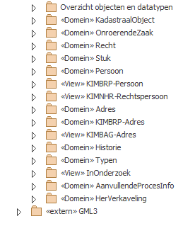

<h2>Achtergrondinformatie IMKAD</h2>

Het informatiemodel van het kadaster beschrijft de basisgegevens van alle onroerende zaken in Nederland, inclusief hun geometrie en de basisgegevens van (lucht)vaartuigen geregistreerd in de Basisregistratie Kadaster (BRK). Daarnaast beschrijft het de rechten van (rechts)personen op deze objecten, zoals het eigendomsrecht en hypotheekrecht.

<h3>Metamodel</h3>

IMKAD is gemodelleerd volgens het [MIM - Metamodel Informatie Modellering](https://docs.geostandaarden.nl/mim/mim10/). Het model is voor het overzicht is onderverdeeld in z.g. “packages”, op basis van de inhoudelijke samenhang van de klassen. 

<h3>Samenhang met andere basisregistraties</h3>

IMKAD heeft relaties met andere basisregistraties in Nederland. De authentieke gegevens over natuurlijke personen (ingezetenen) zijn opgenomen in de basisregistratie BRP en de authentieke gegevens over niet natuurlijke personen (bedrijven en instellingen) in het handelsregister (HR). De authentieke gegevens over adressen en gebouwen zijn opgenomen de basisregistratie Adressen en Gebouwen (BAG). 
De gegevens van personen en adressen zijn in IMKAD opgenomen overeenkomstig de BRP en de BAG. Daarnaast bevat IMKAD eigen klassen voor buitenlandse adressen en postadressen, omdat die niet in BAG zullen komen
IMKAD heeft een plaats binnen een stelsel van standaarden voor geo-informatie binnen de publieke sector. Dit stelsel, beheerd door GeoNovum, bepaalt dat Nederlandse standaarden voor geoinformatie moeten voldoen aan de NEN3610 standaard, het basismodel geo-informatie. Binnen die standaard zijn klassen weer gekoppeld aan de internationale GML standaard. GML is tevens het bij het Basismodel behorende formaat voor uitwisseling van geo-informatie bestanden. GML is een op XML gebaseerde codering om geografische informatie te modelleren, transporteren en op te slaan.

<h3>Basis voor productmodellen</h3>

Wanneer het Kadaster een informatieproduct ontwerpt is het IMKAD model de basis. Voorbeelden van informatie producten zijn KIK aktemodellen, KIK webservices en BRK levering. Voor het beschrijven van een informatieproduct wordt het IMKAD model vereenvoudigd tot die delen die nodig zijn voor het informatieproduct. In sommige gevallen worden de informatieproducten daarnaast verrijkt met andere informatie. Dit is bijvoorbeeld het geval bij KIK aktemodellen. Het productmodel bevat ook elementen die nodig zijn voor het toetsen van de juridische geldigheid van een akte. Deze elementen zijn echter niet nodig in de Basisregistratie Kadaster (BRK) en zitten daarom ook niet in IMKAD.
Het model is bedoeld om een informatieproduct te beschrijven. Vanuit dit productmodel worden vervolgens geautomatiseerd de XML-schema (XSD) of Json-schema (Json) gemaakt definities. Deze definitie bestanden specificeren de structuur waarmee de data worden uitgewisseld. De afnemers van onze informatie kunnen deze bestanden gebruiken bij het bouwen van de koppeling met het Kadaster.

<h3>Opbouw van het model</h3>

Het IMKAD model is opgebouwd uit delen (domain packages) om het overzichtelijk te houden. Ieder deel heeft zijn eigen naam; de namespace. Om toch versies van het model te kunnen onderscheiden, heeft ook het geheel een versienummer gekregen. Dit nummer heeft echter geen directe relatie met de versies van de onderliggende packages. De volgende afbeelding geeft weer hoe de domain packages in IMKAD staan.

De delen van het model die informatie uit ander basisregistraties weergeven zijn opgenomen als `<<`View`>>` Packages die modellen uit andere basisregistraties weergeven.

<h3>Waardelijsten</h3>

In IMKAD worden voor een de gegevens met een vast waardebereik referentielijsten gehanteerd. Deze referentielijsten worden beheerd als lijsten met toegestane waarden (waardelijsten). Een voorbeeld is een lijst met gemeentecodes met bijbehorende gemeentenamen.

Waardelijsten gaan over inhoud, een informatiemodel vooral over structuur. Waardelijsten hebben ook een andere dynamiek dan het informatiemodel. Zo leidt bijvoorbeeld een gemeentelijke herindeling tot een aanpassing van de waardelijst ‘Nederlandse gemeenten’ zonder dat dit gevolgen heeft voor het informatiemodel. De IMKAD waardelijsten worden gepubliceerd op www.kadaster.nl/waardelijsten en zijn ook rechtstreeks te benaderen via de url in het informatiemodel.

<h3>Het openbaar register en de Kadastrale registratie</h3>
Binnen de BRK is er onderscheid te maken tussen het openbaar register en de Kadastrale registratie. Het openbaar register is een documentenregistatie waarin de aan het Kadaster ter inschrijving aangeboden stukken worden opgenomen. Dit zijn over het algemeen stukken die betrekking hebben op het overdragen en vestigen van zakelijke rechten op onroerende zaken.  
Met de informatie die in deze ingeschreven stukken staat wordt de Kadastrale registratie bijgewerkt naar de nieuwe juiste stand. In deze registratie wordt vastgelegd wie welke rechten heeft op een Kadastraal object. Een Kadastraal object is een [onroerende zaak](https://tax.kadaster.nl/doc/begrip/Onroerende_zaak) of een [teboekgestelde zaak](https://tax.kadaster.nl/doc/begrip/Teboekgestelde_zaak). In de BRK is een onroerende zaak een perceel, een appartementsrecht of een netwerk. De teboekgestelde zaken zijn schepen of luchtvaartuigen. Deze zijn echter niet opgenomen in het hier beschreven informatiemodel. 
De Kadastrale registratie is de basis voor veel van de informatieproducten van het kadaster.

In het informatiemodel wordt het openbaar register beschreven met het model in de package `<<`Stuk`>>`. De Kadastrale registratie wordt in de kern beschreven in het package `<<`Recht`>>` met als basis de packages `<<`KadastraalObject`>>`, `<<OnroerendeZaak`>> en `\<<Persoon>>`

<h3>Historie van BRK objecten.</h3>

De informatie van de BRK wordt ingewonnen door het Kadaster. In veel situaties op basis van akten die in het openbaar register (OR) worden opgenomen en in een aantal situaties op basis van andere brondocumenten en inwinningsprocessen. Deze informatie is opgenomen in de basisregistratie. 

Van alle informatie worden extra gegevens bijgehouden, om aan te geven
* van wanneer tot wanneer deze informatie geldig is of was, 
* wanneer deze informatie formeel opgenomen is in de BRK en 
* vanaf wanneer deze informatie beschikbaar is gesteld. 

We noemen dit historiegegevens. Deze extra historiegegevens zijn gemodelleerd in het domein genaamd Historie. De informatiekundige betekenis van deze historiegegevens wordt (waar mogelijk) beschreven conform het NEN3610 model voor historie.  
We onderscheiden historie voor informatie die ingewonnen wordt via het _openbaar register_, en _overige_. 

Voor informatie die via het openbaar register wordt ingewonnen: 
* tijdstipRegistatieOR – tijdsmoment dat het brondocument c.q. de akte opgenomen is in het openbaar register, met daarin een rechtsfeit dat de informatie beschrijft die met de akte geldig is/wordt 
* tijdstipVervallenOR   – tijdsmoment dat het brondocument c.q. de akte opgenomen is in het openbaar register, met daarin een rechtsfeit dat de informatie beschrijft die is komen te vervallen/niet meer geldig is. 
Dit kan dezelfde akte zijn

Alle andere informatie wordt ingewonnen met:
* beginGeldigheid van de informatie - de datum waarop informatie geldig is, in de (administratieve) werkelijkheid 
* eindGeldigheid van de informatie de datum waarop informatie geldig is, in de (administratieve) werkelijkheid

Voor beiden wordt het tijdsmoment van opname in de BRK registratie bijgehouden, ofwel het feitelijke moment van opname in de basisregistratie, als bron. 
*	tijdstipRegistatie – tijdsmoment van opname van informatie in de BRK registratie  
*	eindRegistratie  – tijdsmoment van opname van informatie in de BRK registratie

Verder wordt voor alle informatie bijgehouden: 
*	tijdstipBeschikbaar – moment van beschikbaarstelling in een dienst of product of informatie leveromgeving, zoals de dienst Kadaster online, BRK-levering, BRK-Bevragingen e.a. in die gevallen waarin deze later beschikbaar is gekomen dan vanuit de BRK registratie (deze kan gelijk aan tijdstipRegistatie). 
*	de bron van de wijziging, genaamd audittrail. Deze informatie wordt meestal niet ontsloten/geleverd, maar is er wel als het nodig is op te vragen. 

__BRK historie vs NEN3610 historie__

De historie van de BRK verhoudt zich als volgt tot die van de NEN3610. 

Formele tijdstippen volgens NEN3610:
*	tijdstipRegistatieOR  
*	tijdstipVervallenOR  
*	tijdstipRegistatie in de BRK registratie – definitie conform NEN3610 
*	eindRegistratie in de BRK registratie – definitie conform NEN3610 
* tijdstipBeschikbaar 

Materiele datums/tijdstippen volgens NEN3610 
*	beginGeldigheid van de informatie – definitie conform NEN3610
*	eindGeldigheid van de informatie – definitie conform NEN3610

Ad materiele tijdstippen: 
*	strikt genomen volgt de BRK niet de materiele werkelijkheid, omdat de meeste informatie van de BRK niet materieel aanwezig is in de wereld en omdat de registratie letterlijk achter de feiten aanloopt, de juridische feiten wel te verstaan. Dit zien we wel als materiele historie, maar dan een administratieve interpretatie hiervan. 
*	tijdstipRegistatieOR betekent wel degelijk wanneer bepaalde informatie geldig is geworden, zoals bedoeld in NEN3610. De betekenis van dit gegeven is echter zowel formeel als materieel en is daarom anders dan de definitie van beginGeldigheid en eindGeldigheid van NEN3610. In bevragingen is tijdstipRegistatieOR echter wel als zodanig te gebruiken. 

__Voorkomen/versie__

De historiegegevens worden bijgehouden als voorkomen/versie van een object. Een object(type) is in het informatiemodel te herkennen aan het stereotype ` <<objecttype>>` en dat deze attribuutsoorten overerft van Historie::Voorkomen (`_VoorkomenOR` of `_VoorkomenNen3610` in de rechterbovenhoek van een object). Een voorkomen bevat de gegevens van één object, zoals deze gedurende een bepaalde periode bekend zijn bij het object. Oftewel, de gegevens van één object zoals opgenomen zijn in de BRK, zonder dat de gegevens een wijziging hebben ondergaan. Na elke wijziging ontstaan een nieuw voorkomen. De basis van elk vooromen zijn de BRK gegevens zelf, maar de historiegegevens zelf zijn ook onderdeel van het voorkomen (als metagegevens). 

Een voorkomen/versie wordt uniek aangeduid met een combinatie van gegevens: 
*	identificatie van het object 
*	tijdstipRegistatieOR of beginGeldigheid
*	volgnummer: een opvolgend nummer ter (aanvullende) identificatie van een voorkomen/versie, in aanvulling op de eerste twee gegevens. 

**Volgnummer**: initieel heeft dit attribuut de waarde 0 en dit is vrijwel altijd de waarde. Er kan in bijzondere situaties een nieuwe voorkomen/versie ontstaan, met dezelfde identificatie van het object en dezelfde tijdstipRegistatieOR of beginGeldigheid. Dit gebeurt als er meerdere voorkomens van het object op dezelfde dag ontstaan, of wanneer er een fout hersteld wordt, waarbij de foute gegevens onder dezelfde identificatie bewaard moeten blijven in de registratie. 

**Status**: deze status geeft aan of een gegeven als een normaal geldig gegeven beschouwd moet worden, of dat er iets bijzonders aan de hand is. 
*	G van geldig. Vrijwel alle gegevens hebben deze status. 
*	C van correctie. Gegevens die niet correct waren worden hersteld. De C geeft aan dat de gegevens van dit voorkomen niet meer correct zijn. Deze gegevens worden in principe niet meer uitgeleverd, maar zijn nog wel op te vragen (als het echt nodig is).

De specifieke werking van het bijhouden van historie, zoals wanneer een eindGeldigheid gevuld wordt en dat het moment hiervan gelijk is aan de eindRegistratie, wordt niet beschreven in IMKAD en is in principe ook niet nodig om te bepalen wanneer bepaalde gegevens geldig zijn of waren, of vanaf wanneer dit beschikbaar was voor gebruikers. Het volstaat om te weten dat elk voorkomen/versie uniek aangeduid kan worden met een vaste bestendige uniek identificerende combinatie van gegevens.

<h3>Vertaling naar technische formaten</h3>

Kadaster kent vaste vertalingen naar XML en JSON en andere formaten. Deze zijn altijd model-driven afgeleid van dit informatiemodel en zijn ernaartoe (terug) traceerbaar. De specificaties hiervoor vallen buiten dit informatiemodel, maar horen wel bij het geheel van specificaties rondom IMKAD. 

